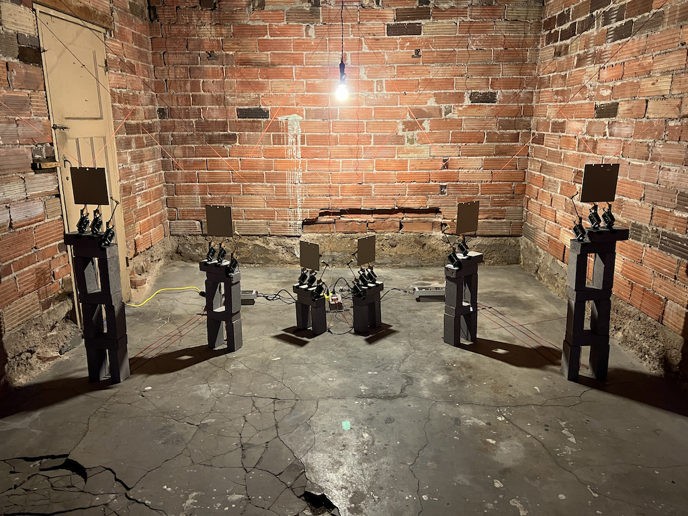
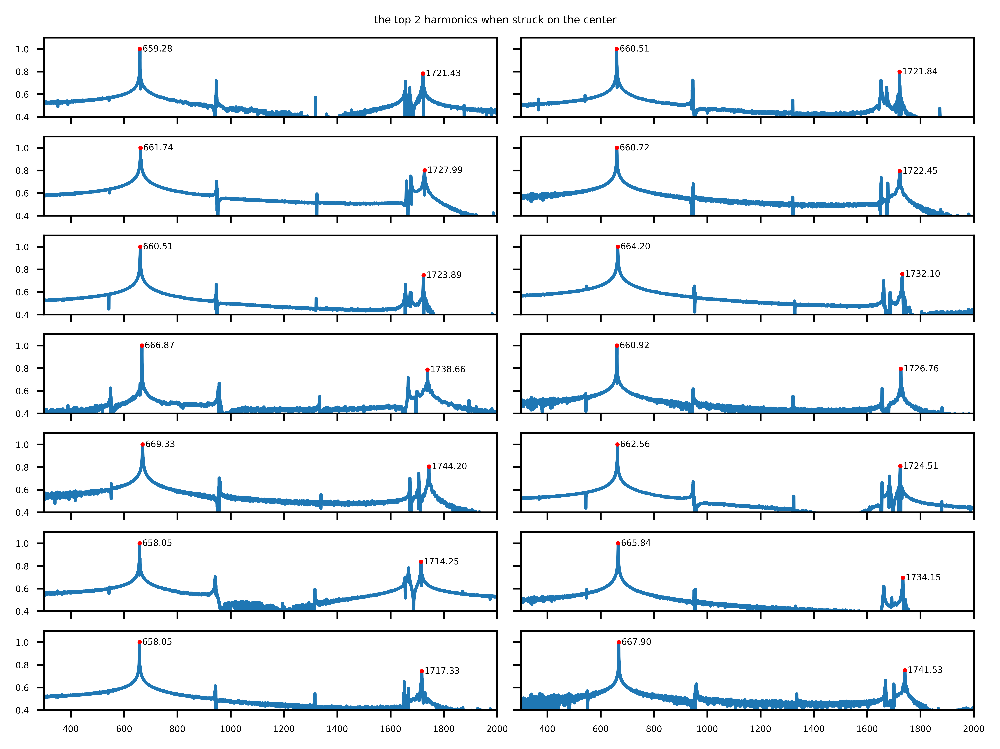
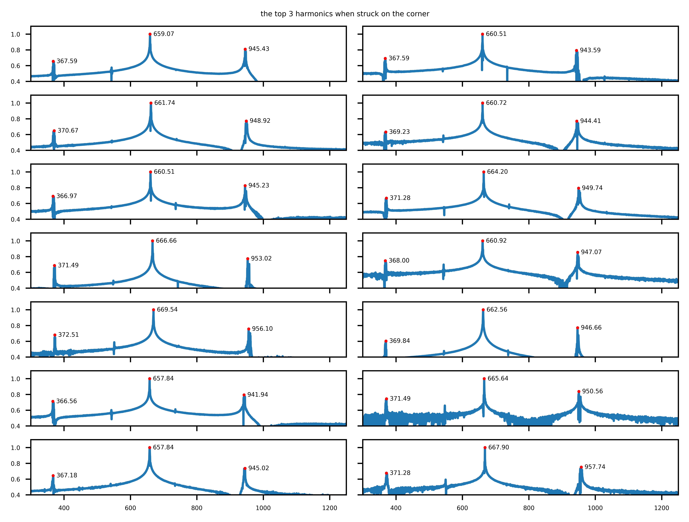
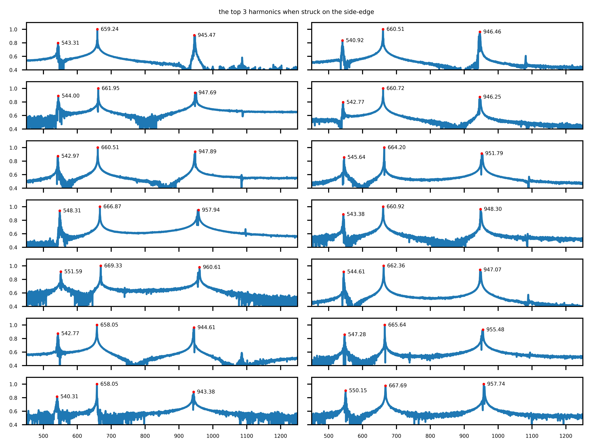

# ladder-spectra

Six metal plates hang from red nylon string, underneath each is a tower of bricks with three solenoids primed to strike at different points on each plate. The plates are from a disassembled ladder steel bookshelf that sat around unused for years - but upon dissasembly of this bookshelf, the spectral peculiarity of these plates became apparent.

There were actually fourteen metal plates gathered from that bookshelf, but I chose six of those fourteen plates based on their spectral qualities. Each of the fourteen plates was struck in three different points that emphasized different sets of harmonics - those strikes were recorded and the resulting recordings were anaylzed to find their most prevalent partials. From that information the composition is formed and the arrangement of the plates was considered.

It is worth mentioning that plates were meant to hold books and were not meant to be used as an instrument, and that is what makes them interesting to me. Assumingly the plates are formed using the same manufaturing process, but their manufacturing standards did not consider their use as an instrument. This resulted in a collection of plates that are all delightfully detuned from each other. I found that each plate has its own peculiar non-linear harmonic series.

I suppose this piece isn't too experiemental, but one goal is to allow for an appreciation of the varying spectra due to the precision of the mechatronic strikes and the sparsity of the composition.

Spectral Analysis
----------------------------------

The plates were ordered by the average value of their harmonics and the six out of fourteen plates were chosen in an attempt to create an equal timbral spread.

|ID |Wave File| 1st     | 2nd     | 3rd     | 4th     | 5th      |
|---|---------|---------|---------|---------|---------|----------|
| A | 11      | 366.562 | 542.766 | 658.048 | 941.944 | 1714.249 |
| B | 13      | 367.178 | 540.306 | 658.049 | 945.023 | 1717.329 |
| C | 2       | 367.588 | 540.920 | 660.509 | 943.585 | 1721.838 |
| D | 1       | 367.588 | 543.311 | 659.279 | 945.431 | 1721.428 |
| E | 5       | 366.972 | 542.972 | 660.509 | 945.226 | 1723.890 |
| F | 4       | 369.229 | 542.766 | 660.715 | 944.406 | 1722.454 |
| G | 8       | 367.998 | 543.382 | 660.920 | 947.072 | 1726.761 |
| H | 10      | 369.844 | 544.613 | 662.561 | 946.662 | 1724.505 |
| I | 3       | 370.665 | 543.997 | 661.740 | 948.919 | 1727.992 |
| J | 6       | 371.280 | 545.638 | 664.202 | 949.739 | 1732.095 |
| K | 12      | 371.485 | 547.279 | 665.843 | 950.560 | 1734.146 |
| L | 7       | 371.485 | 548.305 | 666.868 | 953.021 | 1738.659 |
| M | 9       | 372.511 | 551.587 | 669.330 | 956.098 | 1744.197 |
| N | 14      | 371.281 | 550.152 | 667.895 | 957.741 | 1741.534 |

Plates A, C, H, J, L, and N were chosen for the installation. Based on the 3rd harmonic (the most prevelant), the pitch difference between plates A and L is ~29.7 cents

How to Run the Python Analysis
----------------------------------

I used Python 3.9.6 with numpy, scipy, and matplotlib

How to ChucK on a Raspberry Pi
----------------------------------

Adding ChucK install instructions because this is usually a pain to figure out. First install some dependencies.

    sudo apt-get install bison flex
    sudo apt-get install alsa-base libasound2-dev libsndfile1-dev

Clone the ChucK repository to a suitable directory.

    git clone https://github.com/ccrma/chuck

Now we can change to the `chuck/src` directory and build the makefile.

    cd chuck/src
    make linux-alsa

After it is built, install it.

    sudo make install linux-alsa

Tech Recap
----------------------------------

ChucK is used for serial communication to the Arduinos and recieves OSC communication from Max/MSP.
Max/MSP is used for composition and generative / algorithmic processes that control the three Arduinos and eighteen solenoids.
Python is used for analyzing the spectra and deciphering the prevelant harmonics of the harmonic plates.
Also included are the STLs used for the 3D printing.

This piece has a theme of reclamation, it's pulling me out of a statis; it's dusting off my soul.

